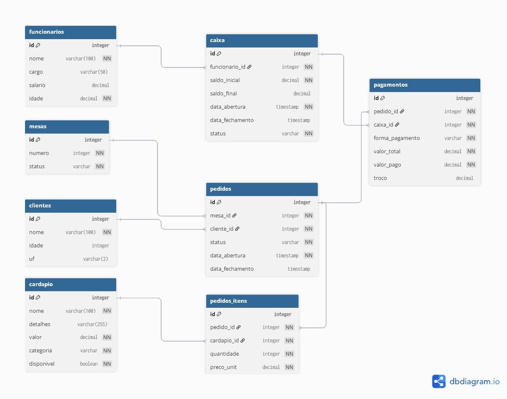

<div align="center">

# 🍽️ Restaurante API

**API RESTful completa para gestão de restaurante**


</div>

---

## 📋 Sobre o Projeto

Sistema de gestão para restaurante com controle de mesas, cardápio, pedidos, caixa e pagamentos. Desenvolvido como projeto real para um restaurante, com autenticação JWT por cargo de funcionário.

---

## 🗄️ Diagrama do Banco de Dados



---

## 🚀 Tecnologias

- **Node.js** + **Express** — servidor e rotas
- **Sequelize ORM** — mapeamento objeto-relacional
- **PostgreSQL** — banco de dados relacional
- **Supabase** — banco de dados na nuvem
- **JWT** — autenticação por token
- **Bcryptjs** — criptografia de senhas

---

## 📁 Estrutura do Projeto

```
src/
├── controllers/     # Lógica de negócio
├── middlewares/     # Autenticação JWT
├── models/          # Modelos Sequelize
├── app.js           # Configuração Express
├── routes.js        # Rotas da API
└── server.js        # Inicialização
```

---

## 🗺️ Rotas da API

### 🔐 Autenticação
| Método | Rota | Descrição |
|--------|------|-----------|
| POST | `/login` | Login do funcionário |

### 👨‍🍳 Funcionários
| Método | Rota | Descrição |
|--------|------|-----------|
| POST | `/funcionarios` | Cadastrar funcionário |
| GET | `/funcionarios` | Listar funcionários |
| GET | `/funcionarios/:id` | Buscar funcionário |
| PUT | `/funcionarios/:id` | Atualizar funcionário |
| DELETE | `/funcionarios/:id` | Remover funcionário |

### 🪑 Mesas
| Método | Rota | Descrição |
|--------|------|-----------|
| POST | `/mesas` | Cadastrar mesa |
| GET | `/mesas` | Listar mesas |
| GET | `/mesas/:id` | Buscar mesa |
| PATCH | `/mesas/:id/status` | Atualizar status |
| DELETE | `/mesas/:id` | Remover mesa |

### 🍕 Cardápio
| Método | Rota | Descrição |
|--------|------|-----------|
| POST | `/cardapio` | Adicionar item |
| GET | `/cardapio` | Listar cardápio |
| GET | `/cardapio/:id` | Buscar item |
| PUT | `/cardapio/:id` | Atualizar item |
| DELETE | `/cardapio/:id` | Remover item |

### 📋 Pedidos
| Método | Rota | Descrição |
|--------|------|-----------|
| POST | `/pedidos` | Abrir pedido |
| GET | `/pedidos` | Listar pedidos |
| GET | `/pedidos/:id` | Buscar pedido |
| PATCH | `/pedidos/:id/status` | Atualizar status |
| POST | `/pedidos/:id/itens` | Adicionar item |
| GET | `/pedidos/:id/itens` | Listar itens |
| PATCH | `/pedidos/:id/itens/:itemId` | Atualizar item |
| DELETE | `/pedidos/:id/itens/:itemId` | Remover item |

### 💰 Caixa
| Método | Rota | Descrição |
|--------|------|-----------|
| POST | `/caixa/abrir` | Abrir caixa |
| GET | `/caixa` | Listar caixas |
| GET | `/caixa/:id` | Buscar caixa |
| PATCH | `/caixa/:id/fechar` | Fechar caixa |

### 💳 Pagamentos
| Método | Rota | Descrição |
|--------|------|-----------|
| POST | `/pagamentos` | Registrar pagamento |
| GET | `/pagamentos` | Listar pagamentos |
| GET | `/pagamentos/:id` | Buscar pagamento |

---

## ⚙️ Como Rodar Localmente

**Pré-requisitos:** Node.js v20+, conta no Supabase

```bash
# Clone o repositório
git clone https://github.com/michaelluisss/restaurante-api.git
cd restaurante-api

# Instale as dependências
npm install

# Configure o .env
cp .env.example .env
# Preencha com suas credenciais do Supabase

# Inicie o servidor
npm run dev
```

### Variáveis de Ambiente

```env
DB_HOST=seu_host_supabase
DB_USER=seu_usuario
DB_PASS=sua_senha
DB_NAME=postgres
JWT_SECRET=sua_chave_secreta
```

---

## 🔒 Autenticação

Todas as rotas (exceto `/login`) exigem token JWT no header:

```
Authorization: Bearer seu_token_aqui
```

Os cargos disponíveis são: `garcom`, `caixa` e `gerencia`.

---

## 👨‍💻 Autor

Feito por [Michael Luis](https://github.com/michaelluisss)
